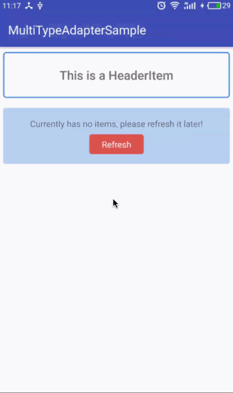

# 借助 android databinding 框架，逃离 adapter 和 viewholder 的噩梦 (1)

## 前言

理解这篇文章最好有 databinding 的基础知识，如果之前没有了解过，推荐下面三篇文章：

1. [官方文档](https://developer.android.com/topic/libraries/data-binding/index.html)
1. [connorlin 的中文翻译](http://connorlin.github.io/2016/07/02/Android-Data-Binding-%E7%B3%BB%E5%88%97-%E4%B8%80-%E8%AF%A6%E7%BB%86%E4%BB%8B%E7%BB%8D%E4%B8%8E%E4%BD%BF%E7%94%A8/)
1. [棉花糖给 Android 带来的 Data Bindings](https://realm.io/cn/news/data-binding-android-boyar-mount/)

但你也可以先看完这篇文章，大致了解 databinding 可以怎么帮助到我们后，再回去看这些基本介绍。

对于 android 开发者来说，诸多噩梦中，adapter 和 viewholder 绝对算一个，倒不是难，而是烦，千遍一率的相似代码，对于程序员来说，重复是最令人讨厌的。所以这才有这么多仁人志士，前俯后继地进行通用型，万能型 adapter 的抽象，这不，最近，我就在鸿洋的公众号又看见这么一篇投稿文章：[优雅的实现多类型列表的Adapter](http://www.jianshu.com/p/1297d2e4d27a)，当然，还有 drakeet 的 [MultiType 项目](https://github.com/drakeet/MultiType)。

但是，由于受限于传统的 android 开发，即使他们已经做得很极致了，但用起来还是不够爽，我们还是要不停地去实现 ViewHolder。

直到我开始学习 databinding 框架 (我现在有一种赶脚，它简直就是人民，哦，不对，android 开发者的大救星啊)，在 [棉花糖给 Android 带来的 Data Bindings](https://realm.io/cn/news/data-binding-android-boyar-mount/) 这篇文章中说到，databinding 可以轻松地实现多类型的 viewholder 时，我在想，我干嘛不用它来解决这个世界性的大难题呢(呵呵)。当下就立马开始尝试，实际，只要你写起来，就会发现，实现起来是非常 easy 和自然的 (但我不知道为什么没有人这么去做，我 google/github 了也没看到类似的，让我陷入了深深地怀疑，难道是我做错了，还恳请各位大神来 review 我的代码并打脸我)。

使用 databinding 框架实现的 adapter 只有 100 行左右的代码，单一 java 文件，理解起来零难度。从此你就可以忘记 viewholder 了。

当然，根据代码守恒定律，代码总量总体是恒定的，我们能使用这么少的代码，背后是 databinding 框架为我们生成的大量代码，眼不见，心不烦，更何况这是 google 为我们生成的代码。

是不是已经按捺不住激动的心情啦。好吧，我们言归正转。其实在之前我已经写 [一篇文章](https://github.com/baurine/android-data-binding-study/blob/master/multi-type-adapter.md) 来阐述这种思想，并写了一个简陋的例子，但后来我还是觉得这个例子太简单了，说服力不够，没有解决很多人关心的问题，在每个通用型 adapter 的文章下面，都有一堆人在问，如果用你这个 adapter，怎么刷新，怎么加载更多，怎么实现 header item，怎么实现 footer item。那么，我就决定，写一个完整的例子，一次性解决你们所有的疑问。并且，我把这个过程写下来，如何一步步实现这些功能，如果一步步重构代码，使代码优雅。最后，即使没有打动你投入 databinding 的怀抱，我觉得你也可以学习到很多。

先来看一下最后的效果，UI 就别吐槽了，毕竟对于工程师来说，独立开发一个应用，最大的问题就是选颜色了(其实是我啦)，本来想用一个 GIF 来展示所有效果的，但一个 GIF 体积太大了，所以就拆成了三个：

1. 演示 HeaderItem，EmptyItem，ErrorItem，刷新，加载更多，加载出错并重试：

   

1. 演示 没有更多数据：

   

1. 稍微润色了一下 UI，为数据 Item 增加各种点击事件：

   

这个完整的例子包括了以下功能，我想应该能满足 90% 的需求吧：

1. 刷新
1. 加载更多
1. 支持 header item
1. 支持 empty item，并允许再次刷新
1. 支持 error item，并允许再次刷新
1. 支持 footer item，包括 3 种状态：加载中，出错并允许重试，没有更多数据
1. 支持多种数据类型的 item，我们在这个例子中只展示了 ImageItem 和 TextItem 两种类型

[下载 apk](https://github.com/baurine/multi-type-adapter/releases/tag/v1.0.5_release)  

[项目地址](https://github.com/baurine/multi-type-adapter)  
这个项目中有两个文件夹，MultiTyepAdapterSample 和 MultiTypeAdapterTutorial，两者代码是几乎相同的，后者是我为了写这篇文章重新创建的，每一个关键步骤我都打好了 tag，以方便读者进行对照。

## 大纲

1. 实现篇
   1. 一步一步实现极简的 adapter

1. 使用篇
   1. 设置 RecyclerView 和 SwipeRefreshLayout
   1. 实现各种状态型 item
   1. 实现刷新
   1. 实现加载更多
   1. 为 item 增加事件处理
   1. 获取 item 的 position
   1. item 与 model 的关系

1. 优化篇
   1. 将 adapter 独立成库
   1. 使用 MVP 简化 Activity 的逻辑

1. 总结篇

------------------------

## 实现篇

### 一步一步实现极简的 adapter

首先创建一个新的 Android Studio 工程，在 app module 的 build.gradle 中加上 databinding 的支持，并导入 recyclerview support 库：

    // build.gradle
    android {
        //...

        dataBinding {
            enabled = true
        }
    }

    dependencies {
        //...
        compile 'com.android.support:recyclerview-v7:25.1.0'
    }

接着，我们来开始来实现这个 adapter，取名为 MultiTypeAdapter，因为我们要支持多类型，那么 adapter 里的 item 必然是抽象的，我们定义为 IItem：

    // MultiTypeAdapter.java
    public interface IItem {
    }

    private List<IItem> items = new ArrayList<>();

我们先从简单的入手，先来看看 `getItemCount()`，我们用 `showHeader` 和 `showFooter` 两个变量来控制是否显示 header 或 footer，那么 `getItemCount()` 的实现如下：

    // MultiTypeAdapter.java
    @Override
    public int getItemCount() {
      int cnt = items.size();
      if (showHeader) {
        cnt++;
      }
      if (showFooter) {
        cnt++;
      }
      return cnt;
    }

接着来实现 `getItemViewType(int position)`，关于这个方法，一般的实现，我们要根据 position 和相应位置的 item 类型来返回不同的值，比如：

    // MultiTypeAdapter.java
    @Override
    public int getItemViewType(int position) {
        if (position == 0 && showHeader) {
          return ITEM_TYPE_HEADER;
        } else if (position == getItemCount() -1 && showFooter) {
          return ITEM_TYPE_FOOTER;
        } else {
          if (items.get(position) instanceof ImageItem) {
            return ITEM_TYPE_IMAGE;
          } else {
            return ITEM_TYPE_TEXT;
          }
        }
    }

这样的实现，很烦很丑是不是。关于这个方法的优化，我们很容易达成一种共识，首先，我们不再返回类似 `ITEM_TYPE_IMAGE` 这种常量类型，而是直接返回它的 xml layout，其次，我们直接从 item 自身得到这个 layout。因此，我们为 IItem 增加一个 `getType()` 的接口方法。代码如下：

    public interface IItem {
      // should directly return layout
      int getType();
    }

    @Override
    public int getItemViewType(int position) {
        if (position == 0 && showHeader) {
          return R.layout.item_header;
        } else if (position == getItemCount() -1 && showFooter) {
          return R.layout.item_footer;
        } else {
          return items.get(position).getType();
        }
    }

因为 header 和 footer，尤其是 footer，只是单纯地用来显示 正在 loading 等一些状态，我们很容易把它跟常规的数据 item 区别对待，但是，实际上我们可以把它看成一个伪 item，没有数据，只有布局的 item。我们分别实现只有布局的 HeaerItem 和 FooterItem，并在合适的时机加到 items 里面或从 items 里移除，就可以控制 header 和 footer 的显示与隐藏了。

    // HeaerItem.java
    public class HeaderItem implements MulitTypeAdapter.IItem {
        @Override
        public int getType() {
            return R.layout.item_header;
        }
    }

    // FooterItem.java
    public class FooterItem implements MulitTypeAdapter.IItem {
        @Override
        public int getType() {
            return R.layout.item_footer;
        }
    }

 这样，我们的 `getItemViewType()` 终于可以简化成一行代码了，清爽！

    @Override
    public int getItemViewType(int position) {
        return items.get(position).getType();
    }

这样，我们也不需要 showHeader 和 showFooter 这样的状态变量了，那么 `getItemCount()` 也可以简化成一行代码了。

    public int getItemCount() {
        return items.size();
    }

刚才说到我们要在合适的时机把 HeaerItem 或 FooterItem 加到 items 或从 items 中移除，所以我们给 adapter 加上一些操作 items 的方法。如下所示：

    // MultiTypeAdapter.java
    public void setItem(IItem item) {
        clearItems();
        addItem(item);
    }

    public void setItems(List<IItem> items) {
        clearItems();
        addItems(items);
    }

    public void addItem(IItem item) {
        items.add(item);
    }

    public void addItem(IItem item, int index) {
        items.add(index, item);
    }

    public void addItems(List<IItem> items) {
        this.items.addAll(items);
    }

    public void removeItem(IItem item) {
        items.remove(item);
    }

    public void clearItems() {
        items.clear();
    }

你可能会想，诶，在这些操作函数里最后再加上 `notifyDatasetChanged()` 是不是会更方便点，这样我在上层就不用再手动调用一下 `adapter.notifyDatasetChanged()`，实际当你自己写起来的时候，你就会发现这样并不灵活。因为，我可能并不想每一次 `addItem` 都刷新一次 UI，我可能要多次 `addItem` 后才刷新一次 UI，这样，在上层由调用者来决定何时刷新 UI 会更灵活，更何况，我可能并不想只调用 `notifyDatasetChanged()`，我有时想调用 `notifyItemRemoved()`，或是 `notifyItemChaned()`。

当然，你也可以给 adapter 加上一个 `getItems()` 的方法，然后把这些对 items 的操作逻辑都移动上层去处理，但我自己还是倾向于在 adapter 内封装这些方法。

    // MulitTypeAdapter.java
    public List<IItem> getItems() {
        return items;
    }

OK，至此，我们仅仅实现了 adapter 的 `getItemCount()` 和 `getItemViewType()` 方法，但是别着急。

截止目前为止的代码：[`tutorial_step_1`](https://github.com/baurine/multi-type-adapter/tree/tutorial_step_1)

接下来，就该处理难啃的的 `onCreateViewHolder()` 和 `onBindViewHolder()` 了，先来看 `onCreateViewHolder()` 吧。

在 `onCreateViewHolder()` 中，我们要根据 viewType 来生成不同的 ViewHolder，假设这里我们只显示 ImageViewHolder 和 TextViewHolder。要显示的 item 分别为 ImageItem 和 TextItem。我们先定义一个抽象基类 ItemViewHolder，代码如下：

    // ItemViewHolder.java
    public abstract class ItemViewHolder extends RecyclerView.ViewHolder {
        public ItemViewHolder(View itemView) {
            super(itemView);
        }

        public abstract void bindTo(MulitTypeAdapter.IItem item);
    }

分别实现 ImageViewHolder 和 TextViewHolder：

    // ImageViewHolder.java
    public class ImageViewHolder extends ItemViewHolder {
        public ImageViewHolder(View itemView) {
            super(itemView);
        }

        public void bindTo(MulitTypeAdapter.IItem item) {
            ImageItem imageItem = (ImageItem) item;
            // then do something
        }
    }

    // TextViewHolder.java
    public class TextViewHolder extends ItemViewHolder {
        public TextViewHolder(View itemView) {
            super(itemView);
        }

        public void bindTo(MulitTypeAdapter.IItem item) {
            TextItem textItem = (TextItem) item;
            // then do something
        }
    }

然后实现 `onCreateViewHolder()`：

    // MulitTypeAdapter.java
    @Override
    public ItemViewHolder onCreateViewHolder(ViewGroup parent, int viewType) {
        View itemView = LayoutInflater.from(parent.getContext())
                .inflate(viewType, parent, false);
        if (viewType == R.layout.item_image) {
            return new ImageViewHolder(itemView);
        } else if (viewType == R.layout.item_text) {
            return new TextViewHolder(itemView);
        }
        return null;
    }

实现 `onBindViewHolder()`：

    // MulitTypeAdapter.java
    @Override
    public void onBindViewHolder(ItemViewHolder holder, int position) {
        holder.bindTo(items.get(position));
    }

可以看到，`onBindViewHolder()` 的实现也已经变得非常简洁。那么就剩下 `onCreateViewHolder()` 了。一般来说，我们会把这一部分逻辑通过工厂方法来优化，代码如下所示：

    // ViewHolderFactory.java
    public class ViewHolderFactory {
        public static ItemViewHolder create(ViewGroup parent, int viewType) {
            View itemView = LayoutInflater.from(parent.getContext())
                    .inflate(viewType, parent, false);
            switch (viewType) {
                case R.layout.item_image:
                    return new ImageViewHolder(itemView);
                case R.layout.item_text:
                    return new TextViewHolder(itemView);
                default:
                    return null;
            }
        }
    }

那么 onCreateViewHolder 就可以同样简化成一行代码，如下所示：

    public ItemViewHolder onCreateViewHolder(ViewGroup parent, int viewType) {
        return ViewHolderFactory.create(parent, viewType);
    }

截止目前为止的代码：[`tutorial_step_2`](https://github.com/baurine/multi-type-adapter/tree/tutorial_step_2)

到目前为止，我们所做的和其它开发者所做的优化并没有什么不同，但是别着急，因为我们都还没有用上 databinding。接下来我们看看 databinding 的表现，看它是如何消除手动创建多个 ViewHolder 的。

我们要把 ImageItem 显示在 `item_image.xml` 上，把 TextItem 显示在 `item_text.xml` 上，我们分别用 databinding 的方式实现这两个 xml。在此之前，我们先来为 ImageItem 和 TextItem 填充一些数据。

借助 [unsplash](https://unsplash.it/) 提供的 url 让 ImageItem 产生随机图片 (别忘了在 AndroidManifest.xml 中加上网络访问权限)，用当前日期时间作为 TextItem 的内容。

    // ImageItem.java
    public class ImageItem implements MulitTypeAdapter.IItem {
        @Override
        public int getType() {
            return R.layout.item_image;
        }

        ////////////////////////////////////////////////
        public final String url;

        public ImageItem() {
            url = "https://unsplash.it/200/200?random&" + new Random().nextInt(40);
        }
    }

    // TextItem.java
    public class TextItem implements MulitTypeAdapter.IItem {
        @Override
        public int getType() {
            return R.layout.item_text;
        }

        ///////////////////////////////////////////
        public final String content;

        public TextItem() {
            content = new Date().toString();
        }
    }

`item_image.xml`：

    <layout>
        <data>
            <variable
                name="item"
                type="com.baurine.multitypeadaptertutorial.item.ImageItem"/>
        </data>

        <LinearLayout
            xmlns:android="http://schemas.android.com/apk/res/android"
            xmlns:app="http://schemas.android.com/apk/res-auto"
            android:layout_width="match_parent"
            android:layout_height="wrap_content"
            android:layout_margin="8dp">

            <ImageView
                android:layout_width="wrap_content"
                android:layout_height="wrap_content"
                app:error="@{@drawable/ic_launcher}"
                app:imageUrl="@{item.url}"
                app:placeholder="@{@drawable/ic_launcher}"/>
        </LinearLayout>
    </layout>

其中 ImageView 的 imageUrl/error/placeholder 属性是使用[强大的 BindingAdapter](https://github.com/baurine/android-data-binding-study/blob/master/note.md) 实现的，代码如下：

    // BindingUtil.java
    public class BindingUtil {
        @BindingAdapter({"imageUrl", "error", "placeholder"})
        public static void loadImage(ImageView imgView,
                                    String url,
                                    Drawable error,
                                    Drawable placeholder) {
            Glide.with(imgView.getContext())
                    .load(url)
                    .error(error)
                    .placeholder(placeholder)
                    .into(imgView);
        }
    }

`item_text.xml`：

    <layout>
        <data>
            <variable
                name="item"
                type="com.baurine.multitypeadaptertutorial.item.TextItem"/>
        </data>

        <LinearLayout
            xmlns:android="http://schemas.android.com/apk/res/android"
            android:layout_width="match_parent"
            android:layout_height="wrap_content"
            android:layout_margin="8dp">

            <TextView
                android:layout_width="wrap_content"
                android:layout_height="wrap_content"
                android:text="@{item.content}"/>
        </LinearLayout>
    </layout>

在使用了 databinding 后，在创建 ViewHolder 时，ViewHolder 里需要保存就是不再是 itemView，而是 ViewDataBinding，每一个使用 `<layout></layout>` 形式的 xml 布局都会被 databinding 框架自动生成一个 ViewDataBinding 类的派生类，比如 `item_image.xml` 会生成 ItemImageBinding，`item_text.xml` 会生成 ItemTextBinding，而 ViewDataBinding 是它们的基类。因此我们改写 ItemViewHolder/ImageViewHolder/TextViewHolder。

    public abstract class ItemViewHolder extends RecyclerView.ViewHolder {
        protected final ViewDataBinding binding;

        public ItemViewHolder(ViewDataBinding binding) {
            super(binding.getRoot());
            this.binding = binding;
        }

        public abstract void bindTo(MulitTypeAdapter.IItem item);
    }

    public class ImageViewHolder extends ItemViewHolder {
        public ImageViewHolder(ViewDataBinding binding) {
            super(binding);
        }

        public void bindTo(MulitTypeAdapter.IItem item) {
            ImageItem imageItem = (ImageItem) item;
            ((ItemImageBinding) binding).setItem(imageItem);
        }
    }

    public class TextViewHolder extends ItemViewHolder {
        public TextViewHolder(ViewDataBinding binding) {
            super(binding);
        }

        public void bindTo(MulitTypeAdapter.IItem item) {
            TextItem textItem = (TextItem) item;
            ((ItemTextBinding) binding).setItem(textItem);
        }
    }

此时，ViewHolderFactory 中的代码是这样的，我们要 inflate 得到 ViewDataBinding，如下所示：

    public class ViewHolderFactory {
        public static ItemViewHolder create(ViewGroup parent, int viewType) {
            ViewDataBinding binding = DataBindingUtil.inflate(LayoutInflater.from(parent.getContext()),
                    viewType, parent, false);
            switch (viewType) {
                case R.layout.item_image:
                    return new ImageViewHolder(binding);
                case R.layout.item_text:
                    return new TextViewHolder(binding);
                default:
                    return null;
            }
        }
    }

截止目前为止的代码：[`tutorial_step_3`](https://github.com/baurine/multi-type-adapter/tree/tutorial_step_3)

接下来，终于到了最关键最核心的一步，下面注意啦，我要开始变形啦。

在 ImageViewHolder 和 TextViewHolder 的 `bindTo()` 方法中，我们分别进行了两次类型转化，但是，实际上，ViewDataBinding 为我们提供了一个另外一个更通用的方法 `setVariable(int variableId, Object obj)` 来对 xml 中的变量进行赋值，注意，它的第二个参数是一个 Object。

比如，在 ImageViewHolder 中，我们持有了 `item_image.xml` 对应的 ItemImageBinding 实例对象，我们可以用自动生成的 `setItem((ImageItem)item)` 方法来进行赋值，也可以使用 `setVariable(BR.item, item)` 来进行赋值，因为这个 ViewDataBinding 实例知道，这个 xml 中 `BR.item` 对应的类型是 ImageItem，所以它会自动把 item 转化成 ImageItem 类型。我们直接来看一下 ItemImageBinding 内部是怎么来实现 `setVariable()`：

    public boolean setVariable(int variableId, Object variable) {
        switch(variableId) {
            case BR.item :
                setItem((com.baurine.multitypeadaptertutorial.item.ImageItem) variable);
                return true;
        }
        return false;
    }

可见，这个方法就是对各种 `setXyz` 方法的一层封装。而因为这个方法是由基类 ViewDataBinding 定义的，根据 OOP 的多态特性，
我们直接调用基类的 `setVariable()` 方法即可，因此，ImageViewHolder 中的 `bindTo()` 方法就可以简化成一行代码：

    public void bindTo(MulitTypeAdapter.IItem item) {
        binding.setVariable(BR.item, item);
    }

而对于 TextViewHolder 来说，也是一样的。

如此一来，如果我们在不同的 item xml 中使用相同的 variable name，如上例中都使用了 `name="item"`，那么 `bindTo()` 方法就可以统一成一种写法了，如上面所示。

ImageViewHolder 和 TextViewHolder 从形式上已经是一样的了，那我们就没有必要实现多个 ViewHolder 了，统一用一个 ItemViewHolder 来实现，并在 `setVariable()` 后执行 `binding.executePendingBindings()` 来让 UI 马上变化：

    public class ItemViewHolder extends RecyclerView.ViewHolder {
        private final ViewDataBinding binding;

        public ItemViewHolder(ViewDataBinding binding) {
            super(binding.getRoot());
            this.binding = binding;
        }

        public void bindTo(MulitTypeAdapter.IItem item) {
            binding.setVariable(BR.item, item);
            binding.executePendingBindings();
        }
    }

但是我们一定要理解的是，单一 ViewHolder 的背后，是由 databinding 框架生成的多个 ViewDataBinding。总体上来说，代码量并没有减少，但对于我们开发者来说，要写的代码和逻辑确是大大减少了。

此时，ViewHolderFactory 可以简化成如下所示：

    public class ViewHolderFactory {
        public static ItemViewHolder create(ViewGroup parent, int viewType) {
            ViewDataBinding binding = DataBindingUtil.inflate(LayoutInflater.from(parent.getContext()),
                    viewType, parent, false);
            return new ItemViewHolder(binding);
        }
    }

但是实际上，由于我们并不需要多个 ViewHolder 了，这个工厂类也就失去意义了，我们把  `create()` 这个方法移到 ItemViewHolder 中，删除 ViewHolderFactory 类，并修改 adapter 的 `onCreateViewHolder()` 方法，如下所示：

    // ItemViewHolder.java
    public static ItemViewHolder create(ViewGroup parent, int viewType) {
        ViewDataBinding binding = DataBindingUtil.inflate(LayoutInflater.from(parent.getContext()),
                viewType, parent, false);
        return new ItemViewHolder(binding);
    }

    // MulitTypeAdapter.java
    public ItemViewHolder onCreateViewHolder(ViewGroup parent, int viewType) {
        return ItemViewHolder.create(parent, viewType);
    }

更进一步，由于我们只有一个 ItemViewHolder，而且不需要对外公开，因此我们把它整体移入到 MulitTypeAdapter 类中，作为内部静态类。至此，整个 adapter 全部完成，全部代码如下所示 ([`tutorial_step_4`](https://github.com/baurine/multi-type-adapter/tree/tutorial_step_4))：

    public class MultiTypeAdapter extends RecyclerView.Adapter<MultiTypeAdapter.ItemViewHolder> {

        public interface IItem {
            // should directly return layout
            int getType();
        }

        private List<IItem> items = new ArrayList<>();

        ///////////////////////////////////////////////////////

        @Override
        public ItemViewHolder onCreateViewHolder(ViewGroup parent, int viewType) {
            return ItemViewHolder.create(parent, viewType);
        }

        @Override
        public void onBindViewHolder(ItemViewHolder holder, int position) {
            holder.bindTo(items.get(position));
        }

        @Override
        public int getItemCount() {
            return items.size();
        }

        @Override
        public int getItemViewType(int position) {
            return items.get(position).getType();
        }

        ///////////////////////////////////////////////////////
        // operate items

        public List<IItem> getItems() {
            return items;
        }

        public void setItem(IItem item) {
            clearItems();
            addItem(item);
        }

        public void setItems(List<IItem> items) {
            clearItems();
            addItems(items);
        }

        public void addItem(IItem item) {
            items.add(item);
        }

        public void addItem(IItem item, int index) {
            items.add(index, item);
        }

        public void addItems(List<IItem> items) {
            this.items.addAll(items);
        }

        public void removeItem(IItem item) {
            items.remove(item);
        }

        public void clearItems() {
            items.clear();
        }

        ///////////////////////////////////////////////////
        static class ItemViewHolder extends RecyclerView.ViewHolder {
            private final ViewDataBinding binding;

            static ItemViewHolder create(ViewGroup parent, int viewType) {
                ViewDataBinding binding = DataBindingUtil.inflate(LayoutInflater.from(parent.getContext()),
                        viewType, parent, false);
                return new ItemViewHolder(binding);
            }

            ItemViewHolder(ViewDataBinding binding) {
                super(binding.getRoot());
                this.binding = binding;
            }

            void bindTo(MultiTypeAdapter.IItem item) {
                binding.setVariable(BR.item, item);
                binding.executePendingBindings();
            }
        }
    }

从此，我们就可以和 viewholder 说拜拜了，我们的重心转移到实现一个又一个的 Item 上，而 Item 是轻量的，我们约定 (暂时地) 在 xml 中统一使用 variable name 为 item，那么 Item 只需要实现 IItem 的 `getType()` 方法就行了。

至此，我们一步一步地实现了这个目前还不到 100 行的极简 adapter，那如何使用它来，来轻松地实现 header, footer 呢，且听 [下回](./multi-type-adapter-tutorial-2.md) 分解。
